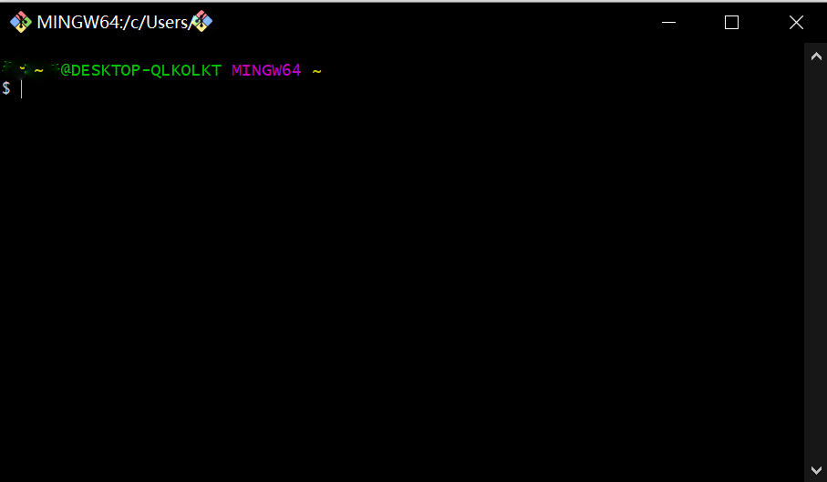

# Git学习笔记
---
## 1. Git简介
Git是目前世界上最先进的分布式版本控制系统，与此相对的是集中式的版本控制系统CVS和SVN。  
集中式版本控制系统的版本库放置在中央服务器，用户使用客户机从服务器获得最新版本，在编辑以后再将文件推送回中央服务器。  
分布式版本控制系统的版本库存储在每个客户机上，互相推送修改后的版本来获取对方的修改。 
### 1.1 Git的安装  
#### 1.1.1 在Linux上安装Git
在Debian或Ubuntu Linux，通过一条`sudo apt-get install git`就可以直接完成Git的安装。  
#### 1.1.2在Windows上安装Git  
安装完成后，在开始菜单里找到“Git”->“Git Bash”，蹦出一个类似命令行窗口的东西

安装完成后，还需要输入user name和Email地址，在命令行输入  
```
$ git config --global user.name "Your Name"
$ git config --global user.email "email@example.com"
```
注意`git config`命令的`--global`参数，用了这个参数，表示你这台机器上所有的Git仓库都会使用这个配置，当然也可以对某个仓库指定不同的用户名和Email地址。
### 1.2 创建版本库
- **注意**，创建仓库前需要确认Git Bash程序当前工作的目录为需要创建仓库的路径，否则需要`cd`到该路径.
- 通过`git init`命令把这个目录变成Git可以管理的仓库
```
$ git init
Initialized empty Git repository in D:/CodeFile/learngit/.git/
```
`.git`目录一般是隐藏的，用于跟踪管理版本，一般不要修改
***
## 2. Git的简单语法及功能简介
### 2.1 把文件添加到仓库  
**主要涉及的命令`add`, `commit`**  
- 首先，我们需要把文件放在仓库目录下（或子目录），以文件`readme.txt`为例,其内容如下：  
```
Git is a distributed version control system.
Git is free software
```
- 然后使用`git add`命令把文件添加到仓库，
```
$ git add readme.txt
```
执行上面的命令，没有任何显示，这表示一切正常，因为Unixd的哲学是——“没有消息就是好消息”。  
- 用命令`git commit`告诉Git，把文件提交到仓库：
```
$ git commit -m "wrote a readme file"
[master (root-commit) 6a1f78b] wrote a readme file
1 file changed, 2 insertions(+)
create mode 100644 readme.txt
```
简单解释一下`git commit`命令，`-m`后面输入的是本次提交的说明，可以输入任意内容，当然最好是有意义的，这样你就能从历史记录里方便地找到改动记录。
`git commit`命令执行成功后会告诉你，`1 file changed`：1个文件被改动（我们新添加的`readme.txt`文件）；`2 insertions`：插入了两行内容（`readme.txt`有两行内容）。  
为什么Git添加文件需要`add`，`commit`一共两步呢？因为`commit`可以一次提交很多文件，所以你可以多次`add`不同的文件，比如：  
```
$ git add file1.txt
$ git add file2.txt file3.txt
$ git commit -m "add 3 files."
```
### 2.2 使用Git进行版本控制
- 使用`status`查看仓库状态
  在`readme.txt`经过修改后，我们运行`git status`命令，可以得到以下结果（仅截取部分输出）：
  ```
  $ git status
  On branch master
  Changes not staged for commit:
  ...
  ```
上面的输出告诉我们，`readme.txt`被修改了，但是还没有加载到暂存区准备提交。  
- 如果`git status`告诉你文件被修改了，用`git diff`可以查看修改的内容。
#### 2.2.1 版本回退
- 使用`git log`查看我们查看历史版本
```
$ git log
commit b34ed6124918e2cf82f4b0121ac183b05b4ac2b5 (HEAD -> master)
Author: PQball <pingjin291@gmail.com>
Date:   Sun Mar 6 17:16:30 2022 +0800

    append GPL

commit 16c1af4a6119195180d936c158a50b94792b6cdf
Author: PQball <pingjin291@gmail.com>
Date:   Sun Mar 6 17:11:29 2022 +0800

    add distributed

commit 6a1f78b8613ef825ddc889b23e6c386ccaaa6ba8
Author: PQball <pingjin291@gmail.com>
Date:   Sun Mar 6 17:02:55 2022 +0800

    wrote a readme file
```
`git log`命令显示最近到最远的提交日志，我们可以看到3次提交，最近的一次是`append GPL`，上一次是`add distributed`，最早的一次是`wrote a readme file`。  
如果嫌输出信息太多，看得眼花缭乱的，可以试试加上`--pretty=oneline`参数:
```
$ git log --pretty=oneline
```
其中的`commit b34ed6...`是`commit id`(版本号)，是一个SHA计算出来的十六进制数字。
- 使用`git reset`进行版本回退  
在Git中，用`HEAD`表示当前版本，上一个版本表示为`HEAD^`,上上个版本表示为`HEAD^^`，往前100个版本表示为`HEAD~100`。
```
$ git reset --hard HEAD^
```
当然，也可以使用`commit id`的方式，版本号不用写全，前几位就可以：
```
$ git reset --hard b34ed612
```
- 使用`git reflog`查看历史`commit id`
```
$ git reflog
```
#### 2.2.2 工作区和暂存区
- **工作区（Working Directory）：**
  就是你在电脑里能看到的目录，比如我的learngit文件夹就是一个工作区：
- **版本库：**
  工作区有一个隐藏目录.git，这个不算工作区，而是Git的版本库。  
  Git的版本库里存了很多东西，其中最重要的就是称为stage（或者叫index）的暂存区，还有Git为我们自动创建的第一个分支master，以及指向master的一个指针叫HEAD。  
  前面讲了我们把文件往Git版本库里添加的时候，是分两步执行的：  
    >第一步是用git add把文件添加进去，实际上就是把文件修改添加到暂存区；   
    >第二步是用git commit提交更改，实际上就是把暂存区的所有内容提交到当前分支。

    因为我们创建Git版本库时，Git自动为我们创建了唯一一个master分支，所以，现在，git commit就是往master分支上提交更改。
#### 2.2.3 管理修改
- Git管理的是修改而不是文件
- 使用`git diff HEAD -- readme.txt`命令可以查看工作区和版本库里面最新版本的区别：
```
  $ git diff HEAD -- readme.txt
  diff --git a/readme.txt b/readme.txt
  index db28b2c..9a8b341 100644
  --- a/readme.txt
  +++ b/readme.txt
  @@ -1,4 +1,4 @@
   Git is a distributed version control system.Git is free software distributed under the GPL.
   Git has a mutable index called stage.
   Git tracks changes.
   \ No newline at end of file
   +Git tracks changes of files.
   \ No newline at end of file
``` 
#### 2.2.4 撤销修改
- `git checkout -- file`可以丢弃工作区的修改:
```
$ git checkout -- readme.txt
```
命令`git checkout -- readme.txt`意思就是，把`readme.txt`文件在工作区的修改全部撤销，这里有两种情况：  
>一种是`readme.txt`自修改后还没有被放到暂存区，现在，撤销修改就回到和版本库一模一样的状态;  
一种是`readme.txt`已经添加到暂存区后，又作了修改，现在，撤销修改就回到添加到暂存区后的状态。  

总之，就是让这个文件回到最近一次`git commit`或`git add`时的状态。
- `git reset HEAD <file>`可以把暂存区的修改撤销掉（unstage），重新放回工作区：
```
$ git reset HEAD readme.txt
```
- **小结**：
>场景1：当你改乱了工作区某个文件的内容，想直接丢弃工作区的修改时，用命令git checkout -- file。  
场景2：当你不但改乱了工作区某个文件的内容，还添加到了暂存区时，想丢弃修改，分两步，第一步用命令git reset HEAD <file>，就回到了场景1，第二步按场景1操作。  
场景3：已经提交了不合适的修改到版本库时，想要撤销本次提交，参考版本回退一节，不过前提是没有推送到远程库。  


#### 2.2.5 删除文件
一般情况下，我们通常直接在文件管理器中把没用的文件删了，或者用`rm`命令删了：
```
$ rm test.txt
```
这个时候，Git知道你删除了文件，因此，工作区和版本库就不一致了，`git status`命令会立刻告诉你哪些文件被删除了,现在你有两个选择，一是确实要从版本库中删除该文件，那就用命令`git rm`删掉，并且`git commit`：
```
$ git rm test.txt
rm 'test.txt'
```
```
$ git commit -m "remove test.txt"
[master 05c2560] remove test.txt
 1 file changed, 0 insertions(+), 0 deletions(-)
 delete mode 100644 test.txt
```
另一种情况是删错了，因为版本库里还有呢，所以可以很轻松地把误删的文件恢复到最新版本：
```
$ git checkout -- test.txt
```
**注意**：从来没有被添加到版本库就被删除的文件，是无法恢复的！

## 3. 远程仓库
### 3.1 添加远程仓库  
GitHub提供免费的仓库托管服务，在注册账号后，建立本地Git仓库和远程Git仓库需要一些设置：
- 第1步：创建SSH Key。打开Shell（Windows下打开Git Bash），创建SSH Key：
```
$ ssh-keygen -t rsa -C "youremail@example.com"
```
  你需要把邮件地址换成你自己的邮件地址，然后一路回车，使用默认值即可，由于这个Key也不是用于军事目的，所以也无需设置密码。  
如果一切顺利的话，可以在用户主目录里找到`.ssh`目录，里面有`id_rsa`和`id_rsa.pub`两个文件，这两个就是`SSH Key`的秘钥对，`id_rsa`是私钥，不能泄露出去，`id_rsa.pub`是公钥，可以放心地告诉任何人。
- 第2步：登陆GitHub，打开“Account settings”，“SSH Keys”页面：  
  然后，点“Add SSH Key”，填上任意Title，在Key文本框里粘贴`id_rsa.pub`文件的内容：

现在，我们需要在GitHub创建一个Git仓库，这里可以参阅GitHub提供的[帮助页面](https://docs.github.com/cn/get-started)。  
在创建Github仓库以后，我们根据GitHub的提示，在本地的`learngit`仓库下运行命令：
```
$ git remote add origin https://github.com/PQball/StudyCode-Note.git
```
*注* 此处我更改了本地仓库的名称。   
下一步，就可以把本地库的所有内容推送到远程库上：
```
$ git push -u origin master
Enumerating objects: 25, done.
Counting objects: 100% (25/25), done.
Delta compression using up to 12 threads
Compressing objects: 100% (20/20), done.
Writing objects: 100% (25/25), 13.11 KiB | 4.37 MiB/s, done.
Total 25 (delta 5), reused 0 (delta 0), pack-reused 0
remote: Resolving deltas: 100% (5/5), done.
To https://github.com/PQball/StudyCode-Note.git
 * [new branch]      master -> master
branch 'master' set up to track 'origin/master'.
```
从现在起，只要本地提交，就可以通过命令：
```
$ git push origin master
```
当你第一次使用Git的clone或者push命令连接GitHub时，会得到一个警告：
```
The authenticity of host 'github.com (xx.xx.xx.xx)' can't be established.
RSA key fingerprint is xx.xx.xx.xx.xx.
Are you sure you want to continue connecting (yes/no)?
```
这是因为Git使用SSH连接，而SSH连接在第一次验证GitHub服务器的Key时，需要你确认GitHub的Key的指纹信息是否真的来自GitHub的服务器，输入yes回车即可。  
### 3.2 删除远程库 
如果添加的时候地址写错了，或者就是想删除远程库，可以用`git remote rm <name>`命令。使用前，建议先用`git remote -v`查看远程库信息:
```
$ git remote -v
origin  git@github.com:michaelliao/learn-git.git (fetch)
origin  git@github.com:michaelliao/learn-git.git (push)
```
然后，根据名字删除，比如删除`origin`：
```
$ git remote rm origin
```
### 3.3 从远程库克隆
假如我们在Github上已经有一个远程仓库`gitskills`，下一步是用命令`git clone`克隆一个本地库：
```
$ git clone git@github.com:PQball/gitskills.git
```
